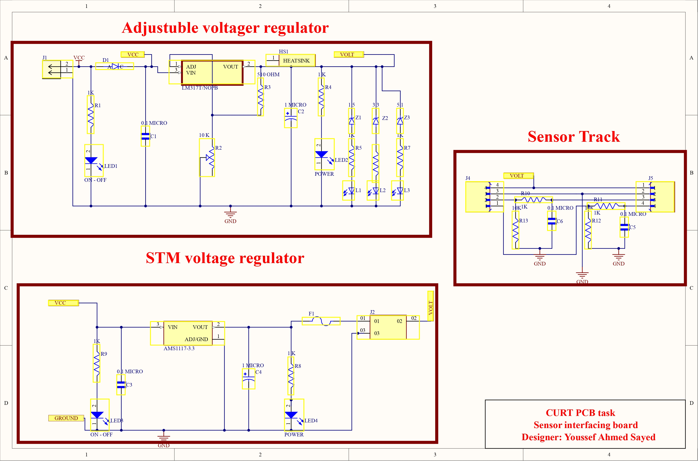
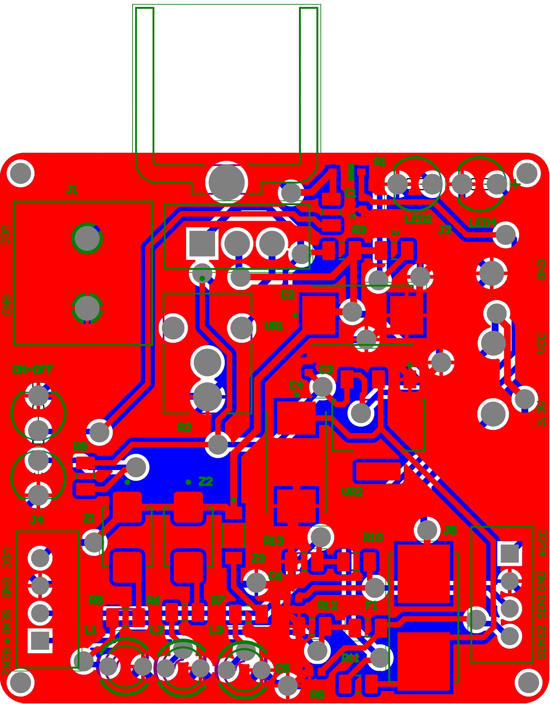
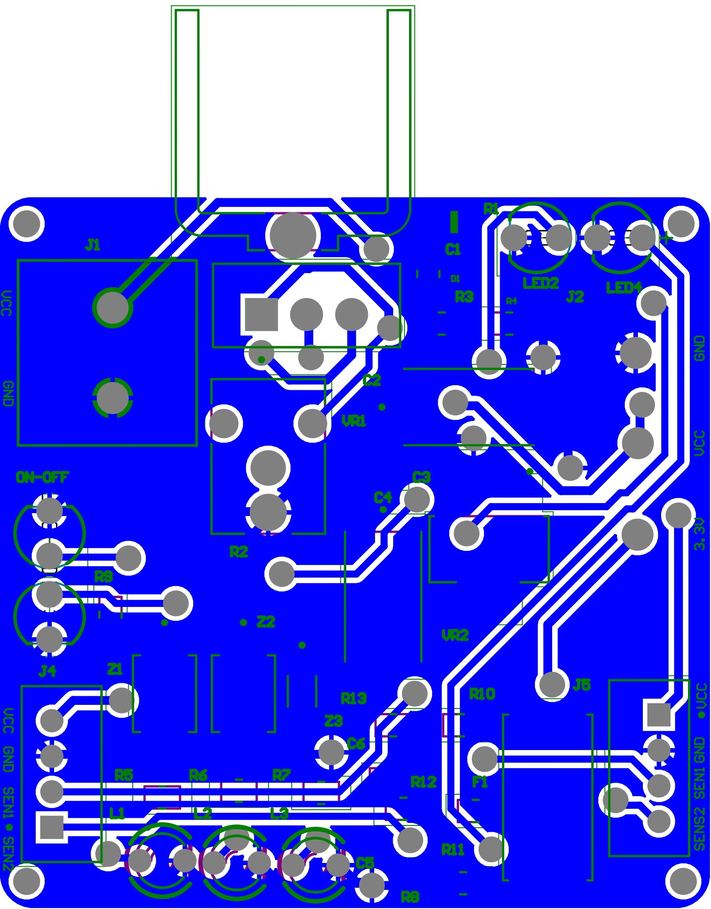
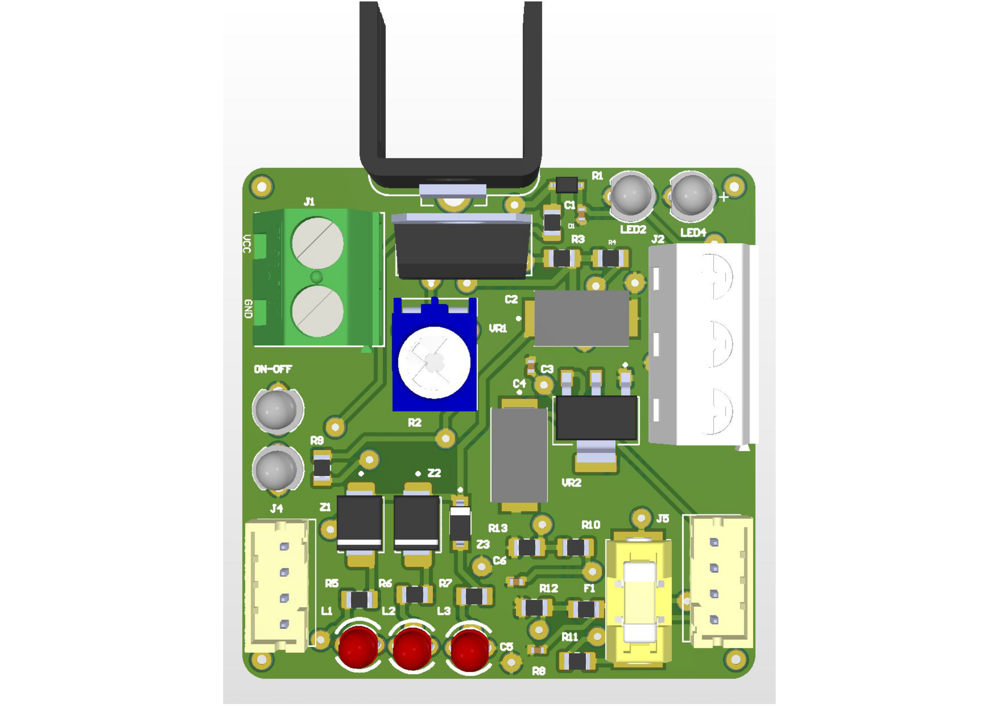
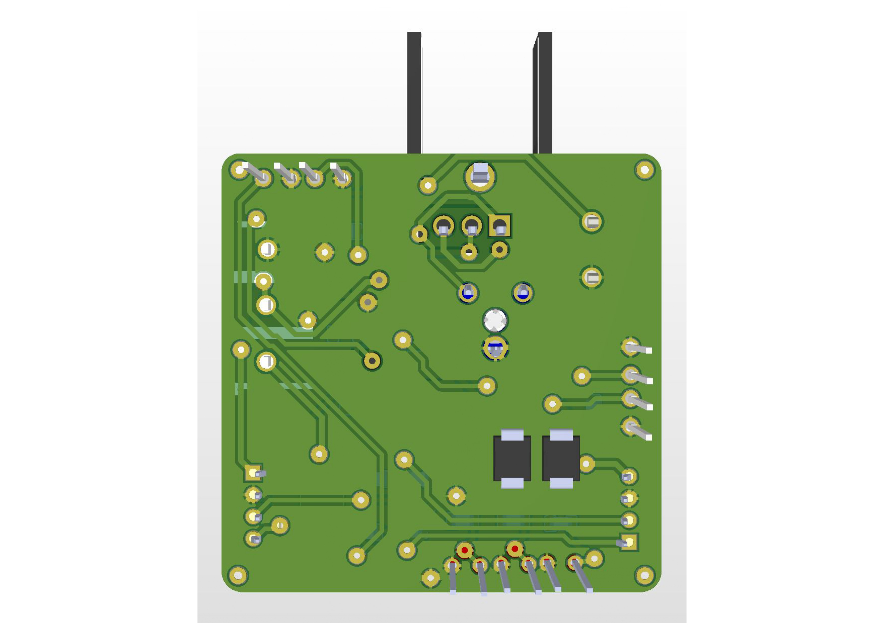

# STM32 Sensor Interface & Power Management Board

## 📌 Project Overview
This repository contains the hardware design files for a custom, compact **40x40 mm** Sensor Interface and Power Management PCB. It is specifically designed to provide stable power and clean, noise-free sensor signal interfacing for the **STM32 Blue Pill** microcontroller.

## ✨ Key Features
* **Dual Power Regulation:**
  * **Adjustable Output:** Uses an `LM317T` adjustable voltage regulator equipped with a heatsink for efficient thermal dissipation.
  * **3.3V Dedicated Output:** Uses an `AMS1117-33` regulator to supply stable 3.3V specifically for the STM32 MCU.
* **Hardware Protection:** Integrated fuse on the 3.3V line to protect the microcontroller from overcurrent conditions.
* **Dual Sensor Interface (2 Channels):**
  * **Noise Reduction:** Hardware RC filters implemented on the sensor data lines to eliminate high-frequency noise.
  * **Stability:** 10kΩ pull-down resistors are added to the sensor inputs to prevent floating pins and ensure reliable default logic states.
* **Robust Connectivity:** Uses heavy-duty screw terminals and secure clip headers to durably handle both high and low power demands. All connectors are strategically placed at the board edges for mechanical stability and easy wiring access.
* **Design Standards:** 100% DRC (Design Rule Check) error-free.

## 📡 PCB Layout & Signal Integrity (SI)
This board was meticulously designed with Signal Integrity (SI) and thermal management in mind:
* **Layer Stackup:** Double-layer PCB design.
* **Trace Width Optimization:** Power and Ground traces are widened to **0.5mm** to safely handle higher current loads, while standard signal traces are kept at a minimum width of **0.4mm**.
* **Orthogonal Routing (Crosstalk Mitigation):** Traces on the top and bottom layers are routed perpendicularly (forming an 'X' crossing pattern rather than running parallel). This prevents capacitive coupling and eliminates crosstalk between layers.
* **Thermal Management:** Optimized placement of the heatsink and regulators to ensure even heat distribution without affecting sensitive sensor signal paths.
* **Design Standards:** 100% DRC (Design Rule Check) error-free, strictly adhering to electrical and manufacturing constraints.

## 📷 Board Visuals

*(Note: The images below showcase the schematic and the final PCB layout)*

### Schematic Design

### 2D PCB Layout Top

### 2D PCB Layout Bottom

### 3D View (Top)

### 3D View (Bottom)

## 🛠️ EDA Tool Used
* Altium Designer

## 👨‍💻 Author
**Youssef Ahmed Sayed**
